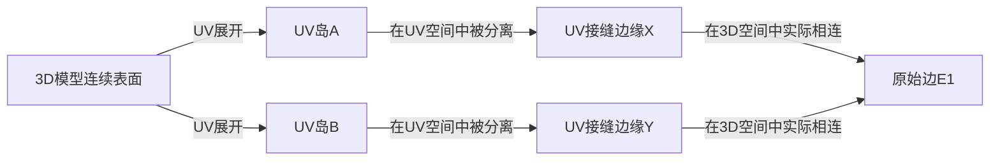

# UV岛邻接图技术文档

## 摘要
**UV岛邻接图**（UV Island Adjacency Map）是一种记录3D模型UV展开中，被分离的UV岛之间原始邻接关系的数据结构。它不直接呈现给最终用户，而是作为元数据，为纹理处理、烘焙和渲染提供关键的拓扑连接信息，是实现高级"UV岛跳跃"效果的技术基础。

## 1. 核心概念

### 1.1 UV展开的固有缺陷
当3D模型表面被展开为2D UV坐标时，模型必须被"切割"以展平。切割处产生的**UV接缝**（UV Seams）在UV空间中是分离的，但在3D空间中，这些位置原本是连续的表面。



### 1.2 问题的本质
在UV空间中，接缝两侧的边：
- 拥有**不同的UV坐标**
- 属于**不同的UV岛**
- 但在3D网格中，它们代表**同一条边**的左右两侧

### 1.3 UV岛邻接图的定义
邻接图是一种数据结构，它**显式记录**了以下对应关系：
> "UV岛A上的边E_A ↔ UV岛B上的边E_B，在3D网格中原本是连续的"

## 2. 技术规格

### 2.1 数据结构
```python
class UVIslandAdjacencyMap:
    # 基本条目结构
    class AdjacencyEntry:
        edge_pair: Tuple[EdgeID, EdgeID]  # 对应的两条边ID
        uv_islands: Tuple[IslandID, IslandID]  # 所属的UV岛
        transform_info: TransformData  # 可选的变换信息
        geometric_data: dict  # 几何信息（长度、角度等）
    
    # 图结构
    adjacency_dict: Dict[EdgeID, AdjacencyEntry]  # 边到邻接关系的映射
    island_adjacency: Dict[IslandID, List[IslandID]]  # UV岛到邻接岛的映射
    
    # 查询接口
    def find_adjacent_edge(self, edge_id: EdgeID) -> Optional[EdgeID]
    def get_island_connections(self, island_id: IslandID) -> List[IslandID]
    def get_seam_transforms(self) -> Dict[EdgePair, Transform]
```

### 2.2 信息存储内容
邻接图中的每个条目应包含：

| 字段 | 类型 | 描述 |
|------|------|------|
| **源边标识** | (IslandID, PrimID, LocalEdgeIndex) | 源UV岛中边的唯一标识 |
| **目标边标识** | (IslandID, PrimID, LocalEdgeIndex) | 邻接UV岛中对应边的标识 |
| **3D几何对应** | (VertexIDs[2], 3DLength, 3DAngle) | 两条边在3D空间中的实际顶点对应和几何属性 |
| **UV空间关系** | (UVOffset, Rotation, Scale) | 从源边到目标边的UV空间变换参数 |
| **拓扑信息** | (WindingOrder, OrientationMatch) | 两条边的缠绕顺序和对齐状态 |

## 3. 构建算法详解

### 3.1 算法前提
- 输入：具有有效UV展开的3D网格
- 所需数据结构：**半边结构**（Half-Edge Structure）
- 预处理：识别UV岛、标记UV边界边

### 3.2 核心算法步骤

#### 步骤1：数据准备与初始化
```python
def prepare_mesh_data(mesh, uv_coords):
    """准备算法所需的网格和UV数据"""
    
    # 1.1 构建半边数据结构
    halfedge_mesh = build_halfedge_structure(mesh)
    
    # 1.2 识别UV岛（连通分量分析）
    uv_islands = []
    visited_faces = set()
    
    for face in mesh.faces:
        if face not in visited_faces:
            # 基于UV连续性进行泛洪填充
            island = flood_fill_by_uv_connectivity(
                face, visited_faces, mesh, uv_coords
            )
            uv_islands.append(island)
    
    # 1.3 标记所有UV边界边
    boundary_edges = []
    for edge in mesh.edges:
        if is_uv_boundary_edge(edge, uv_coords):
            boundary_edges.append(edge)
            edge.tag = "UV_BOUNDARY"
    
    return halfedge_mesh, uv_islands, boundary_edges
```

#### 步骤2：邻接关系检测算法
```python
def build_adjacency_map(halfedge_mesh, uv_islands, boundary_edges):
    """构建UV岛邻接图的核心算法"""
    
    adjacency_map = {}
    spatial_index = build_edge_spatial_index(boundary_edges)
    
    for source_edge in boundary_edges:
        # 2.1 获取源边的UV信息
        source_uv_mid = get_edge_uv_midpoint(source_edge)
        source_island = get_edge_island(source_edge, uv_islands)
        
        # 2.2 在UV空间中搜索最近边
        candidate_edges = spatial_index.query_nearby(
            source_uv_mid, 
            max_distance=SEARCH_THRESHOLD
        )
        
        # 过滤：排除同岛边和非边界边
        candidate_edges = filter_candidates(
            candidate_edges, 
            exclude_island=source_island,
            must_be_boundary=True
        )
        
        if not candidate_edges:
            continue
        
        # 2.3 精确匹配检测
        best_match = None
        best_score = float('inf')
        
        for cand_edge in candidate_edges:
            # 2.3.1 几何一致性检查
            if not check_3d_continuity(source_edge, cand_edge):
                continue
            
            # 2.3.2 计算匹配分数
            score = compute_matching_score(
                source_edge, 
                cand_edge, 
                spatial_weight=0.7, 
                geometric_weight=0.3
            )
            
            if score < best_score:
                best_score = score
                best_match = cand_edge
        
        if best_match and best_score < MATCH_THRESHOLD:
            # 2.4 通过半边结构验证邻接
            if verify_adjacency_via_halfedge(source_edge, best_match):
                # 2.5 记录邻接关系
                entry = create_adjacency_entry(
                    source_edge, 
                    best_match, 
                    score=best_score
                )
                adjacency_map[source_edge.id] = entry
    
    return adjacency_map
```

#### 步骤3：半边验证（关键技术）
```python
def verify_adjacency_via_halfedge(edge_a, edge_b):
    """通过半边结构验证两条边是否真正邻接"""
    
    # 3.1 获取边A的半边表示
    halfedge_a = get_halfedge_of_edge(edge_a)
    if halfedge_a is None:
        return False
    
    # 3.2 获取"半边朋友"（配对半边）
    halfedge_twin = halfedge_a.twin
    
    if halfedge_twin is None:
        # 边界边，没有配对的半边
        return False
    
    # 3.3 检查边B是否与"朋友半边"关联
    # 关键：如果边B是边A在3D空间中的邻接边，
    # 那么边B应该与halfedge_twin相关联
    
    # 方法1：检查边B是否与halfedge_twin的边相同
    if get_edge_of_halfedge(halfedge_twin) == edge_b:
        return True
    
    # 方法2：通过顶点对应关系验证
    vertices_a = get_edge_vertices(edge_a)
    vertices_b = get_edge_vertices(edge_b)
    
    # 检查顶点是否匹配（考虑顺序）
    if (are_vertices_corresponding(vertices_a, vertices_b, reversed=True)):
        return True
    
    return False
```

#### 步骤4：变换信息计算
```python
def compute_seam_transform(edge_a, edge_b, uv_coords):
    """计算接缝处的UV变换关系"""
    
    # 4.1 获取边的UV坐标
    uv_a1, uv_a2 = get_edge_uvs(edge_a, uv_coords)
    uv_b1, uv_b2 = get_edge_uvs(edge_b, uv_coords)
    
    # 4.2 计算最优顶点对应
    # 两条边的顶点顺序可能相反
    correspondence = find_best_vertex_correspondence(
        [uv_a1, uv_a2], 
        [uv_b1, uv_b2]
    )
    
    if correspondence is None:
        return None
    
    # 4.3 计算2D相似变换（旋转、平移、缩放）
    transform = compute_2d_similarity_transform(
        source_points=[uv_a1, uv_a2],
        target_points=[uv_b1, uv_b2],
        correspondence=correspondence
    )
    
    return {
        'transform': transform,  # 2x3变换矩阵
        'correspondence': correspondence,  # 顶点对应关系
        'uv_length_a': distance(uv_a1, uv_a2),
        'uv_length_b': distance(uv_b1, uv_b2),
        'length_ratio': distance(uv_b1, uv_b2) / distance(uv_a1, uv_a2)
    }
```

## 4. 实现细节与优化

### 4.1 空间加速结构
为了提高最近边搜索的效率，必须使用空间索引：

```python
def build_edge_spatial_index(boundary_edges):
    """为UV边界边构建空间索引"""
    
    # 使用网格划分或四叉树
    index = QuadtreeIndex(resolution=256)  # 假设UV空间为[0,1]范围
    
    for edge in boundary_edges:
        # 使用边的UV包围盒
        uv_bbox = compute_edge_uv_bounding_box(edge)
        
        # 将边插入到覆盖其UV范围的所有单元格中
        cells = index.get_cells_covered_by(uv_bbox)
        for cell in cells:
            cell.add_edge(edge)
    
    return index

def query_nearby_edges(query_uv, index, max_distance=0.1):
    """查询UV空间附近的边"""
    
    # 1. 确定搜索范围
    search_bbox = BoundingBox(
        query_uv.x - max_distance,
        query_uv.y - max_distance,
        query_uv.x + max_distance,
        query_uv.y + max_distance
    )
    
    # 2. 从索引中获取候选边
    candidate_cells = index.get_cells_in_bbox(search_bbox)
    candidate_edges = set()
    
    for cell in candidate_cells:
        candidate_edges.update(cell.edges)
    
    # 3. 精确距离过滤
    results = []
    for edge in candidate_edges:
        edge_uv_mid = get_edge_uv_midpoint(edge)
        dist = distance(query_uv, edge_uv_mid)
        
        if dist <= max_distance:
            results.append((edge, dist))
    
    # 按距离排序
    results.sort(key=lambda x: x[1])
    return [edge for edge, _ in results]
```

### 4.2 几何一致性检查
确保匹配的边在3D空间中也具有一致的几何属性：

```python
def check_3d_continuity(edge_a, edge_b):
    """检查两条边在3D空间中的连续性"""
    
    # 获取3D顶点
    verts_a = get_edge_3d_vertices(edge_a)  # (v_a1, v_a2)
    verts_b = get_edge_3d_vertices(edge_b)  # (v_b1, v_b2)
    
    # 检查边长一致性（允许微小误差）
    length_a = distance_3d(verts_a[0], verts_a[1])
    length_b = distance_3d(verts_b[0], verts_b[1])
    
    length_ratio = length_a / length_b
    if length_ratio < 0.99 or length_ratio > 1.01:
        return False  # 边长差异太大
    
    # 检查法线连续性（可选）
    normal_a = compute_edge_average_normal(edge_a)
    normal_b = compute_edge_average_normal(edge_b)
    
    dot_product = dot(normal_a, normal_b)
    if dot_product < 0.7:  # 夹角大于45度
        return False
    
    return True
```

### 4.3 匹配分数计算
综合多个因素评估匹配质量：

```python
def compute_matching_score(edge_a, edge_b, spatial_weight=0.6, 
                          geometric_weight=0.4):
    """计算两条边的匹配分数（越低越好）"""
    
    # 1. 空间接近度分数
    uv_mid_a = get_edge_uv_midpoint(edge_a)
    uv_mid_b = get_edge_uv_midpoint(edge_b)
    spatial_dist = distance(uv_mid_a, uv_mid_b)
    
    # 归一化处理（假设UV空间在[0,1]范围）
    spatial_score = spatial_dist / math.sqrt(2.0)  # 最大可能距离为√2
    
    # 2. 几何一致性分数
    geo_score = 0.0
    
    # 边长一致性
    length_a = get_3d_length(edge_a)
    length_b = get_3d_length(edge_b)
    length_diff = abs(length_a - length_b) / max(length_a, length_b)
    
    # 方向一致性（在3D空间中）
    dir_a = normalize(get_edge_direction_3d(edge_a))
    dir_b = normalize(get_edge_direction_3d(edge_b))
    dir_dot = abs(dot(dir_a, dir_b))
    dir_score = 1.0 - dir_dot  # 完全同向为0，垂直为1
    
    geo_score = 0.7 * length_diff + 0.3 * dir_score
    
    # 3. 综合分数
    total_score = (spatial_weight * spatial_score + 
                   geometric_weight * geo_score)
    
    return total_score
```

## 5. 应用场景

### 5.1 纹理烘焙（核心应用）
```python
def bake_with_seam_correction(highpoly_mesh, lowpoly_mesh, adjacency_map):
    """使用邻接图进行无接缝烘焙"""
    
    for texel in lowpoly_mesh.texels:
        if texel.is_near_seam(adjacency_map):
            # 对于接缝附近的纹素，从两侧采样并混合
            primary_color = sample_highpoly(texel.uv, highpoly_mesh)
            
            # 获取邻接信息
            adj_info = adjacency_map.get_adjacent_info(texel.edge)
            if adj_info:
                # 转换到邻接UV岛
                adjacent_uv = transform_uv(texel.uv, adj_info.transform)
                secondary_color = sample_highpoly(adjacent_uv, highpoly_mesh)
                
                # 基于距离接缝的远近进行混合
                blend_weight = compute_blend_weight(texel.distance_to_seam)
                final_color = lerp(primary_color, secondary_color, blend_weight)
                return final_color
        
        # 非接缝区域正常采样
        return sample_highpoly(texel.uv, highpoly_mesh)
```

### 5.2 实时渲染中的UV跳跃
在着色器中实现动态UV修正：

```hlsl
// HLSL着色器代码示例
Texture2D mainTexture;
SamplerState textureSampler;

// 邻接图数据（预计算为纹理）
Texture2D adjacencyTexture;  // RGB: 邻接UV, A: 混合权重

float4 PS_UVIslandHopping(PS_Input input) : SV_Target
{
    // 1. 正常采样
    float4 color = mainTexture.Sample(textureSampler, input.uv);
    
    // 2. 检查是否在接缝附近
    float2 seam_info = adjacencyTexture.Sample(textureSampler, input.uv).rg;
    
    if (seam_info.x > 0.0)  // 有邻接信息
    {
        // 3. 从邻接图获取邻接UV
        float2 adjacent_uv = seam_info;
        
        // 4. 采样邻接UV岛的颜色
        float4 adjacent_color = mainTexture.Sample(textureSampler, adjacent_uv);
        
        // 5. 基于到接缝的距离进行混合
        float blend_factor = adjacencyTexture.Sample(textureSampler, input.uv).a;
        color = lerp(color, adjacent_color, blend_factor);
    }
    
    return color;
}
```

## 6. 实践指南

### 6.1 在Houdini中实现
```python
# Houdini Python节点示例
node = hou.pwd()
geo = node.geometry()

# 创建用于存储邻接关系的属性
geo.addAttrib(hou.attribType.Prim, "adjacent_prim", -1)
geo.addAttrib(hou.attribType.Prim, "adjacent_edge", -1)
geo.addAttrib(hou.attribType.Prim, "adjacent_uv", hou.Vector2(0, 0))

# 获取所有UV边界边
boundary_edges = []
for prim in geo.prims():
    if is_uv_boundary_prim(prim):
        boundary_edges.extend(get_prim_boundary_edges(prim))

# 构建空间索引
uv_index = build_uv_spatial_index(geo)

# 查找并记录邻接关系
for edge in boundary_edges:
    edge_uv = get_edge_uv_center(edge)
    nearest_edges = uv_index.find_nearest(edge_uv, count=5, max_dist=0.1)
    
    for candidate in nearest_edges:
        if are_edges_adjacent_in_3d(edge, candidate):
            # 记录邻接信息
            set_adjacency_data(edge.prim(), candidate.prim(), 
                             get_edge_index(edge, candidate.prim()),
                             get_uv_transform(edge, candidate))
            break
```

### 6.2 在Blender中实现
```python
# Blender Python API示例
import bpy
import bmesh
import mathutils
from mathutils.kdtree import KDTree

def build_uv_adjacency_map(obj):
    """在Blender中构建UV邻接图"""
    
    mesh = obj.data
    bm = bmesh.new()
    bm.from_mesh(mesh)
    
    # 确保有UV层
    uv_layer = bm.loops.layers.uv.active
    if not uv_layer:
        raise Exception("Mesh has no UV coordinates")
    
    # 识别UV边界循环
    boundary_loops = []
    for edge in bm.edges:
        if is_uv_boundary_edge(edge, uv_layer):
            boundary_loops.extend(get_edge_loops(edge))
    
    # 构建UV空间的KD树用于快速搜索
    kd = KDTree(len(boundary_loops))
    for i, loop in enumerate(boundary_loops):
        uv = loop[uv_layer].uv
        kd.insert((uv.x, uv.y, 0), i)
    kd.balance()
    
    # 查找邻接关系
    adjacency_map = {}
    for i, loop in enumerate(boundary_loops):
        uv = loop[uv_layer].uv
        co = (uv.x, uv.y, 0)
        
        # 查找最近的UV边界循环（排除自身）
        for (_, idx, _) in kd.find_n(co, 5):  # 找最近的5个
            if idx == i:
                continue
                
            candidate_loop = boundary_loops[idx]
            if are_loops_3d_adjacent(loop, candidate_loop):
                # 记录邻接关系
                store_adjacency(adjacency_map, loop, candidate_loop)
                break
    
    bm.free()
    return adjacency_map
```

## 7. 性能优化建议

### 7.1 索引优化
- **使用四叉树**而非线性搜索进行UV空间查询
- **预计算UV边界边**，减少检查数量
- **多级缓存**：频繁查询的结果应缓存

### 7.2 内存优化
- 使用紧凑的数据结构存储邻接信息
- 对于对称关系，只存储一次
- 使用16位整数索引而非完整对象引用

### 7.3 并行化处理
```python
# 邻接检测的并行实现
from concurrent.futures import ThreadPoolExecutor
import numpy as np

def build_adjacency_map_parallel(boundary_edges, num_threads=8):
    """并行构建邻接图"""
    
    # 分割任务
    edge_chunks = np.array_split(boundary_edges, num_threads)
    
    adjacency_map = {}
    
    def process_chunk(chunk):
        chunk_results = {}
        for edge in chunk:
            # ... 处理逻辑 ...
            chunk_results[edge.id] = adj_info
        return chunk_results
    
    # 并行处理
    with ThreadPoolExecutor(max_workers=num_threads) as executor:
        results = list(executor.map(process_chunk, edge_chunks))
    
    # 合并结果
    for result in results:
        adjacency_map.update(result)
    
    return adjacency_map
```

## 8. 测试与验证

### 8.1 验证方法
1. **可视化检查**：将邻接关系可视化叠加在UV编辑器上
2. **完整性检查**：确保所有UV边界都有对应的邻接关系
3. **对称性检查**：邻接关系应该是双向的
4. **烘焙测试**：使用邻接图进行法线贴图烘焙，检查接缝质量

### 8.2 常见问题与调试
- **问题**：邻接关系不完整
  - **原因**：UV空间搜索阈值太小
  - **解决**：适当增加搜索范围，添加几何一致性检查

- **问题**：错误匹配
  - **原因**：仅依赖空间距离，未考虑几何连续性
  - **解决**：增加3D几何验证，使用综合匹配分数

- **问题**：性能瓶颈
  - **原因**：线性搜索所有边
  - **解决**：使用空间索引结构，并行处理

## 9. 总结

UV岛邻接图是连接UV空间分离与3D空间连续性的关键桥梁。通过精确记录UV岛之间的拓扑邻接关系，它使得：

1. **无接缝纹理处理**成为可能
2. **高级UV操作**（如程序化纹理跳跃）得以实现
3. **渲染质量**显著提升，消除可见接缝

实现一个鲁棒的邻接图构建系统需要综合运用计算几何、空间索引和网格拓扑分析技术。虽然实现复杂度较高，但对于专业3D工具和高质量实时渲染应用，这种技术提供了解决UV接缝问题的根本性方案。

在实际应用中，建议首先评估现有工具（如Houdini的UV工具、Substance的烘焙器）是否已提供类似功能，仅在确有自定义需求时实现完整的邻接图系统。对于大多数实时渲染需求，三平面投影等技术可能是更实用的替代方案。