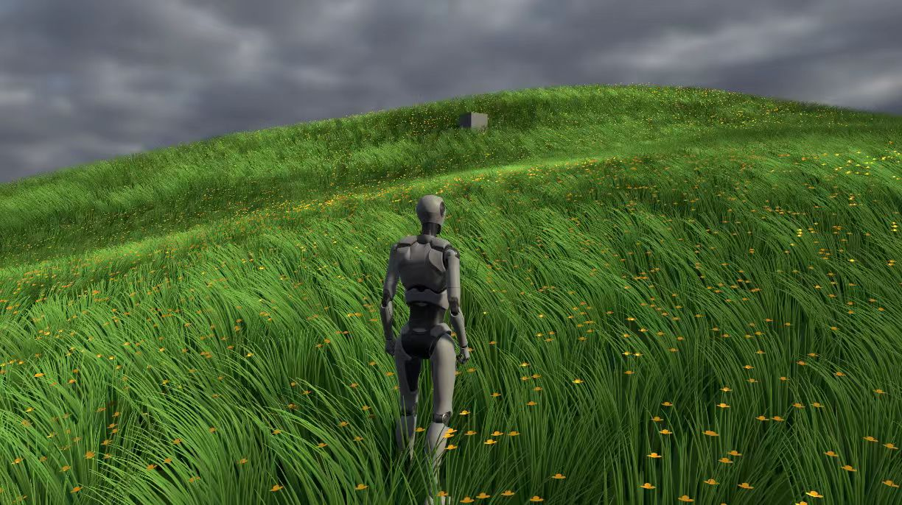
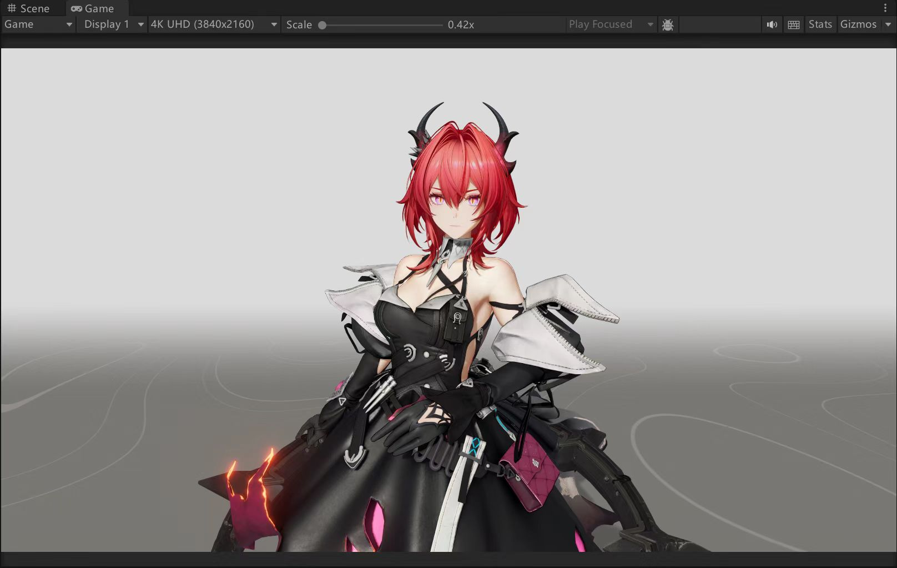
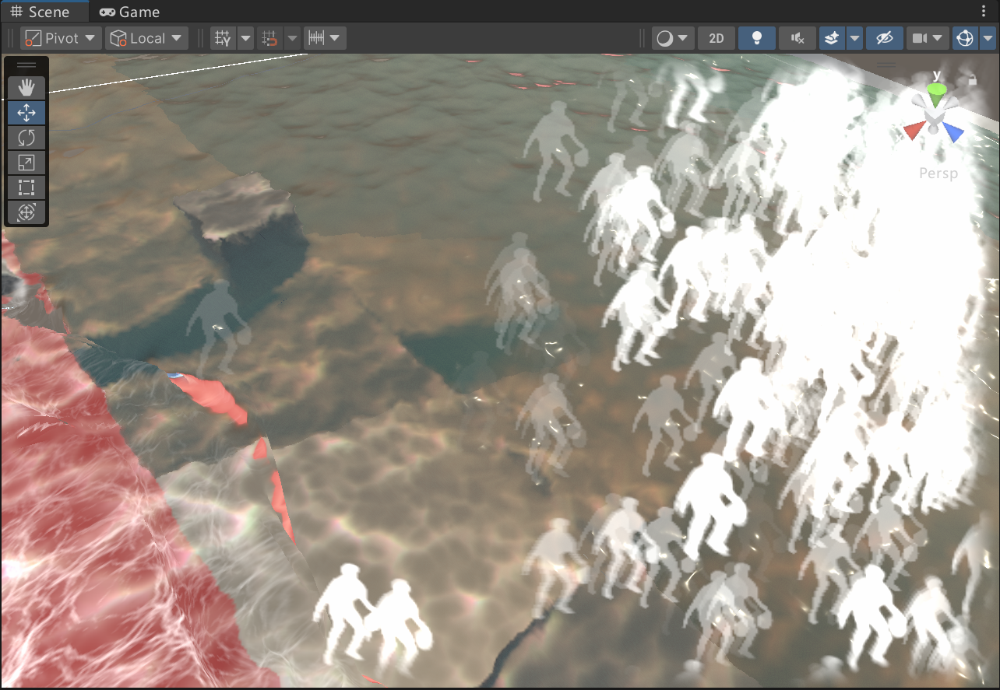
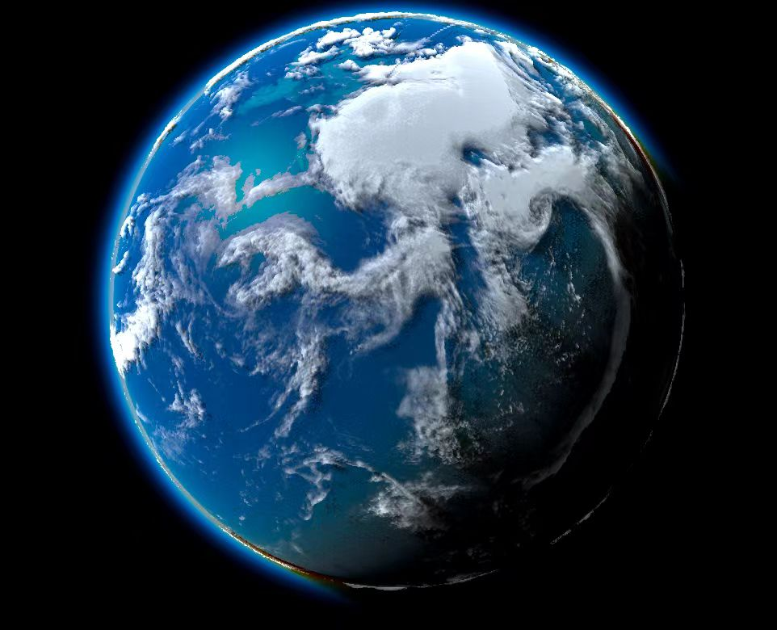
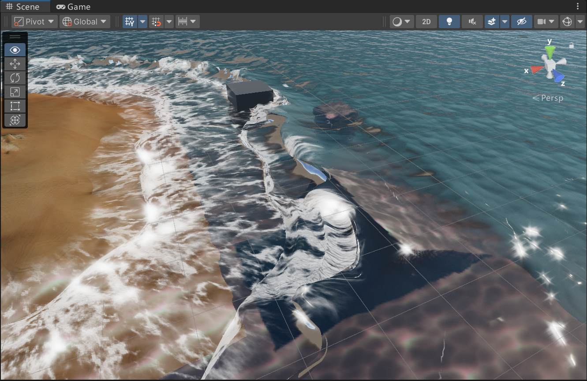
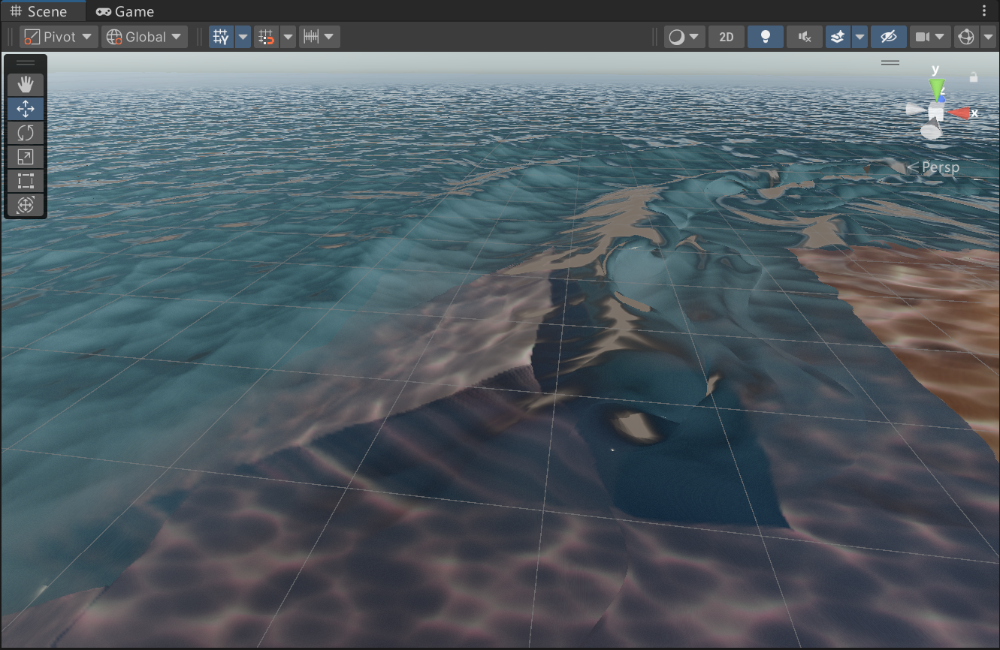
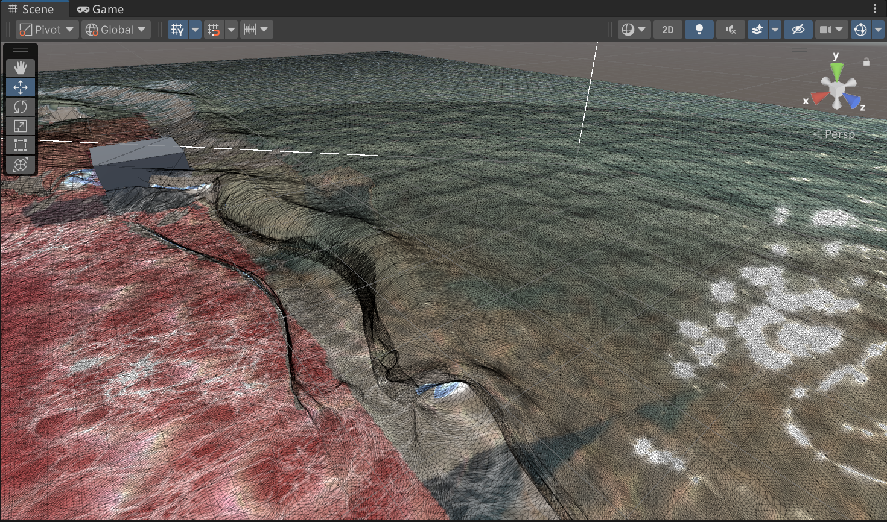

# Unity URP 学习项目

> 2025年12月开始的Unity URP渲染管线学习与实践项目

## 目录

- [无限草与角色流体场系统](#无限草与角色流体场系统)
  - [无限草渲染系统](#无限草渲染系统)
  - [角色流体场](#角色流体场)
- [终末地史尔特尔渲染模拟](#终末地史尔特尔渲染模拟)
  - [Per Object Shadow 阴影系统](#per-object-shadow-阴影系统)
  - [法线外扩描边](#法线外扩描边)
  - [屏幕空间边缘检测描边](#屏幕空间边缘检测描边)
  - [角色表面流水模拟](#角色表面流水模拟)
  - [角色材质系统](#角色材质系统)
  - [距离雾与屏幕雨效](#距离雾与屏幕雨效)
- [频域高光系统](#频域高光系统)
  - [编辑器工具：时域频域转换](#编辑器工具时域频域转换)
  - [运行时渲染系统](#运行时渲染系统)
- [大气散射系统](#大气散射系统)
  - [后处理大气散射](#后处理大气散射)
  - [LUT 预计算大气散射](#lut-预计算大气散射)
  - [物体级大气材质](#物体级大气材质)
  - [物理散射模型](#物理散射模型)
- [水面渲染系统](#水面渲染系统)
  - [JFA SDF 实时距离场](#jfa-sdf-实时距离场)
  - [暴力求解 SDF 离线烘焙](#暴力求解-sdf-离线烘焙)
  - [水体 BSDF 散射模型](#水体-bsdf-散射模型)
  - [前向散射与次表面散射](#前向散射与次表面散射)
  - [焦散与散射模糊系统](#焦散与散射模糊系统)
  - [海浪动画系统](#海浪动画系统)
  - [距离细分着色器](#距离细分着色器)

***

## 无限草与角色流体场系统

> 基于 GPU 驱动的无限草地渲染系统，配套角色流体场实现动态交互，全流程 GPU 计算、剔除、动画，CPU 零负担。

***



### 无限草渲染系统

#### 核心架构

**分段式多类型植被管理**：单 Compute Buffer 分段存储不同类型植被，为不同植物分配固定索引区间（如 A 类 0-49999、B 类 50000-99999），配套 GPU 原子计数器数组，独立管控每类植被的实例数量、写入位置与渲染范围。

**解决痛点**：彻底避免多植被类型多 Buffer / 多 Draw Call 带来的内存冗余与 CPU 批次开销，实现单 / 极少 Draw Call 完成全类型植被渲染，完美适配 SRP Batcher/GPU Instancing，天然支持开放世界无限地形扩展。

#### 渲染流程

**1. 高度图渲染**

- 从正上方渲染地形高度图（R通道：高度，G通道：草生成区域标记）
- 动态更新纹理中心点，跟随相机移动
- 步进式更新避免频繁重绘

**2. Tile 粗过滤**

- 将渲染区域划分为 8×8 的 Tile 网格
- 每个 Tile 进行视锥剔除检测
- 只保留可见 Tile 用于后续细过滤

**3. 草实例细过滤**

- **高度图剔除**：采样高度图判断是否在有效区域
- **视锥剔除**：将世界坐标转换到裁剪空间判断可见性
- **遮挡剔除**：对比相机空间深度图，剔除被遮挡的草
- **距离密度降级**：根据距离随机剔除远处草叶，渐进降低密度

**4. 间接渲染**

- 使用 `DrawMeshInstancedIndirect` 进行 GPU 驱动渲染
- Compute Shader 写入位置缓冲区和计数器
- 自动同步渲染参数

#### 技术栈

| 技术点                           | 说明               |
| ----------------------------- | ---------------- |
| **Compute Shader**            | 全流程 GPU 计算、剔除、动画 |
| **DrawMeshInstancedIndirect** | GPU 驱动间接渲染       |
| **高度图系统**                     | 正交投影渲染地形高度       |
| **Tile 剔除**                   | 粗过滤 + 细过滤两级剔除    |
| **视锥/遮挡剔除**                   | 裁剪空间 + 深度对比      |
| **原子计数器**                     | GPU 端实例计数        |

#### 配套能力

- **地形适配生长**：基于高度图自动匹配地形高度
- **距离密度降级**：远处草叶自动稀疏，优化性能
- **动态交互**：支持角色流体场驱动的草体交互
- **多类型支持**：分段存储不同草类型，独立计数
- **参数化控制**：绘制距离、间距、最大数量等全可调

#### 可调参数

| 参数                     | 作用            |
| ---------------------- | ------------- |
| textureSize            | 高度图分辨率        |
| drawDistance           | 草绘制距离         |
| textureUpdateThreshold | 纹理更新阈值        |
| spacing                | 草间距           |
| maxBufferCount         | 最大草数量（单位：10万） |

***

### 角色流体场

#### 核心功能

基于 Navier-Stokes 方程的实时流体模拟系统，用于驱动草体动态交互，实现角色走过草地的自然交互效果。

#### 技术栈

| 技术点                  | 说明         |
| -------------------- | ---------- |
| **Navier-Stokes 方程** | 流体动力学核心方程  |
| **平流项**              | 速度场的自我传输   |
| **压力投影**             | 保证不可压缩性    |
| **Compute Shader**   | GPU 加速流体计算 |

#### 模拟流程

**1. 平流项（Advection）**

- 速度场沿自身方向传输
- 半拉格朗日方法追踪粒子
- 支持跟随角色移动方向

**2. 压力求解（Pressure Projection）**

- 雅可比迭代求解压力场
- 保证流体不可压缩性
- 可配置迭代次数

**3. 速度投影（Projection）**

- 从速度场中减去压力梯度
- 得到无散度的速度场

**4. 染料可视化（Dye）**

- 可视化流体场
- 支持衰减控制

#### 角色交互

- **脚步检测**：检测双脚是否着地
- **力场施加**：根据角色移动方向施加力
- **跟随系统**：流体场跟随角色位置移动
- **全局传递**：速度场作为全局纹理传递给草体 Shader

#### 可调参数

| 参数                 | 作用      |
| ------------------ | ------- |
| size               | 模拟网格大小  |
| dt                 | 时间步长    |
| penRadius          | 影响半径    |
| SpeedScale         | 施加力的大小  |
| advectSpeed        | 平流速度    |
| pressureIterations | 雅可比迭代次数 |
| speedAttenuation   | 速度衰减系数  |
| colorAttenuation   | 染料衰减系数  |

#### 技术亮点

1. **物理精确**：基于真实流体动力学方程
2. **实时性能**：全 GPU 计算，支持实时交互
3. **无缝集成**：与无限草系统完美配合
4. **参数化控制**：支持美术快速调整效果

***

## 终末地史尔特尔渲染模拟

> 模拟《明日方舟：终末地》中史尔特尔角色的完整渲染方案，包含阴影、描边、流水效果和角色材质系统。

***



### Per Object Shadow 阴影系统

#### 核心功能

实现角色级别的软阴影效果，支持 PCSS（Percentage Closer Soft Shadows）和 Compute Shader 降噪。

#### 技术栈

| 技术点                   | 说明            |
| --------------------- | ------------- |
| **灯光空间深度图**           | 从主光源视角渲染深度图   |
| **PCSS 软阴影**          | 基于距离的动态模糊半径   |
| **Poisson 采样**        | 随机采样消除锯齿      |
| **Compute Shader 降噪** | GPU 加速的屏幕空间模糊 |

#### 渲染流程

1. **灯光空间深度图渲染**
   - 自动计算场景物体包围盒
   - 动态构建光源相机 VP 矩阵
   - 渲染指定 Layer 物体到深度纹理
2. **屏幕空间 PCSS 计算**
   - 降采样渲染提高性能
   - Poisson 圆盘采样
   - 基于距离的动态模糊强度
3. **Compute Shader 降噪**
   - 双边滤波保留边缘
   - 可配置采样次数和步长

#### 可调参数

| 参数              | 作用           |
| --------------- | ------------ |
| ShadowMapSize   | 阴影贴图分辨率      |
| PoissonCount    | Poisson 采样数量 |
| InitPCSS        | 初始 PCSS 模糊半径 |
| DistancePCSS    | 距离 PCSS 模糊强度 |
| BlurSampleCount | 降噪采样次数       |
| BlurStepSize    | 降噪采样步长       |

***

### 法线外扩描边

#### 核心功能

基于法线外扩的实体化描边方案，支持每个物体独立配置描边参数，并可采样物体主纹理颜色。

#### 技术特点

- **组件化设计**：`OutLineRenderData` 组件挂载到物体上，可独立配置颜色和宽度
- **颜色贴图采样**：描边颜色自动匹配物体主纹理，避免跳色问题
- **MaterialPropertyBlock**：高效传递每个物体的独立参数，避免材质实例化开销

#### 实现要点

- 通过 `MaterialPropertyBlock` 传递参数
- 采样物体 `_DTex` 作为描边颜色参考
- 支持多材质物体的描边

***

### 屏幕空间边缘检测描边

#### 核心功能

基于深度和法线的屏幕空间边缘检测描边，适用于需要统一描边风格的场景。

#### 技术栈

| 技术点        | 说明             |
| ---------- | -------------- |
| **深度边缘检测** | 基于深度差异检测轮廓     |
| **法线边缘检测** | 基于法线差异检测轮廓     |
| **后处理方式**  | 全屏后处理，无需修改物体材质 |

#### 渲染流程

1. 渲染指定 Layer 物体的深度和法线到 RT
2. Sobel 算子进行边缘检测
3. 与屏幕颜色混合输出

***

### 角色表面流水模拟

#### 核心功能

模拟角色表面的动态流水效果，包括水滴滑落、水痕扩散等。

#### 技术实现

- **程序化水滴**：基于噪声函数生成动态水滴
- **水痕效果**：水滴滑落后的痕迹
- **多层叠加**：静态水滴 + 动态水滴 + 水痕

***

### 角色材质系统

#### 核心功能

完整的二次元角色材质系统，包含身体、头发、面部、眼睛、眉毛、衣物等多个部位的专用 Shader。

#### Shader 列表

| Shader                      | 用途                    |
| --------------------------- | --------------------- |
| S\_Actor\_Body              | 角色身体（支持皮肤/非皮肤模式）      |
| S\_Actor\_Hair              | 角色头发（透明排序、Stencil 遮挡） |
| S\_Actor\_Face              | 角色面部                  |
| S\_Actor\_Brow              | 角色眉毛                  |
| S\_Actor\_Iris              | 角色眼睛/虹膜               |
| S\_Actor\_Cloth             | 角色衣物                  |
| S\_Actor\_Shadow\_Hair2Face | 头发投射到面部的阴影            |
| S\_Actor\_Shadow\_Eye       | 眼睛阴影                  |

#### 技术特点

- **Ramp 图光照**：卡通渲染的渐变光照
- **MatCap 高光**：材质捕获高光
- **菲涅尔边缘光**：增强角色轮廓
- **法线贴图解码**：支持终末地特有的法线压缩格式
- **透视矫正**：二次元角色的透视修正
- **Stencil 遮挡**：头发与面部的正确遮挡关系

***

### 距离雾与屏幕雨效

#### 核心功能

基于深度的距离雾效果和屏幕空间雨滴效果，通过 Renderer Feature 实现全屏后处理。

#### 技术实现

**距离雾**

- 采样相机深度纹理
- 转换为线性深度（视图空间深度）
- 基于深度的雾气混合

**屏幕雨效**

- 程序化雨滴生成：基于噪声函数的多层雨滴
- 雨滴折射：采样偏移产生透过雨滴看到的效果
- 雨滴高光：边缘高光增强真实感
- 深度控制：近处无雨效，远处逐渐增强

#### 雨滴算法

**多层雨滴叠加**

- 第一层：大雨滴（scale=0.15）
- 第二层：中雨滴（scale=0.055）
- 第三层：小雨滴（scale=0.025）

**雨滴形状**

- 主水滴：圆形 + 位置偏移
- 水痕：垂直拖尾效果
- 随机分布：基于哈希函数的伪随机位置

#### 可调参数

| 参数    | 说明         |
| ----- | ---------- |
| 雾起始距离 | 雾效果开始的距离   |
| 雾结束距离 | 雾效果达到最大的距离 |
| 雾颜色   | 雾气颜色       |
| 雨滴速度  | 雨滴下落速度     |
| 雨滴密度  | 雨滴数量密度     |

#### 技术亮点

1. **深度驱动**：基于真实深度的雾气和雨效
2. **程序化生成**：无需贴图，纯数学生成雨滴
3. **多层叠加**：三层雨滴产生丰富的视觉效果
4. **性能友好**：全屏后处理，单 Pass 完成

***

## 频域高光系统

> 通过频域卷积实现自定义形状的高光效果，支持任意2D形状作为高光模板，包含编辑器预计算工具和运行时渲染系统。

***



### 编辑器工具：时域频域转换

#### 核心功能

Editor 窗口工具，用于时域图片与频域图片之间的相互转换，支持 FFT、IFFT、验证和频域相乘操作。

#### 转换模式

| 模式         | 说明                           |
| ---------- | ---------------------------- |
| **时域→频域**  | 将高光形状图片转换为频域数据（R=实部，G=虚部）    |
| **频域→时域**  | 将频域数据转换回时域，用于验证 FFT 正确性      |
| **验证 FFT** | 执行 FFT→IFFT 完整循环，验证结果是否与原图一致 |
| **频域相乘**   | 两张频域图逐像素复数乘法，实现卷积定理          |

#### 工作流程

**1. 时域转频域（FFT）**

- 输入：黑底白图的高光形状
- 处理：位反转重排 → 蝶形运算 → FFTShift
- 输出：复数格式频域图

**2. 验证正确性**

- 执行完整的 FFT→IFFT 循环
- 输出原图、频域图、还原图三张图片
- 自动计算最大差异值

**3. 频域相乘**

- 输入两张频域图
- 执行复数乘法
- 输出卷积结果频域图

#### 可视化功能

- 对数缩放幅度谱，便于观察低频细节
- 自动归一化显示
- 支持 64/128/256/512/1024 多种尺寸

***

### 运行时渲染系统

#### 核心功能

URP Renderer Feature 实现的实时频域高光渲染，通过预计算的形状频谱实现自定义形状高光。

#### 渲染 Pipeline（5步）

```
高光提取 → FFT变换 → 频域相乘 → IFFT逆变换 → 屏幕合成
```

**1. 高光提取模块**

- 亮度提取：灰度转换 + smoothstep 阈值分割
- 距离限制：深度纹理采样，近/远距离淡出
- 可调参数：Threshold、Softness、DistanceMin、DistanceMax

**2. FFT/IFFT 计算模块**

- 算法：Cooley-Tukey DIT-FFT
- 时间复杂度：O(N log N)
- 关键步骤：位反转重排 → 蝶形运算 → FFTShift
- 双缓冲乒乓操作避免读写冲突

**3. 频域相乘模块**

- 数学原理：卷积定理（时域卷积 = 频域相乘）
- 场景高光频谱 × 形状核频谱 = 卷积结果

**4. 高光形状预处理**

- 四角对称布局转换
- 宽高比校正确保形状不失真
- 自动生成频谱图

**5. 屏幕合成模块**

- 双线性插值放大到全屏分辨率
- 边界淡出防止 FFT 周期性伪影
- Additive Blending 叠加高光

#### 调试支持

4个阶段可视化调试：

- HighlightExtract：高光提取结果
- FFT：频域幅度谱
- Multiply：频域相乘结果
- IFFT：最终高光效果

***

### 技术亮点

1. **数学原理**：巧妙利用卷积定理，将复杂卷积转化为高效乘法
2. **GPU加速**：全 Compute Shader 实现，实时处理
3. **预计算优化**：编辑器预计算形状频谱，运行时零 FFT 开销
4. **编辑器工具**：完整的时域/频域转换工具链
5. **灵活性**：支持任意2D形状作为高光模板

***

## 大气散射系统

> 物理真实的大气散射效果，支持从大气层内到太空中的完整视角，提供后处理、LUT 预计算、物体材质三种实现方式。

***

### 后处理大气散射



#### 核心功能

通过 Renderer Feature 实现的全屏后处理大气散射效果，支持从大气层内部和太空中观看。

#### 技术实现

**Renderer Feature 架构**

- 注入时机：AfterRenderingPostProcessing
- 自动获取主光源方向
- 传递相机世界位置和逆视投影矩阵

**Ray Marching 流程**

1. 计算视线与大气层球体的交点
2. 沿视线方向步进采样大气密度
3. 对每个采样点计算光照方向的散射积分
4. 累加得到最终散射颜色

#### 可调参数

| 参数                  | 说明              |
| ------------------- | --------------- |
| PlanetRadius        | 行星半径（米）         |
| AtmosphereHeight    | 大气层厚度（米）        |
| Altitude            | 观察者海拔（千米）       |
| RayleighScaleHeight | Rayleigh 散射特征高度 |
| MieScaleHeight      | Mie 散射特征高度      |
| NumSamples          | 视线方向采样数         |
| NumSamplesLight     | 光照方向采样数         |

***

### LUT 预计算大气散射

#### 核心功能

通过预计算大气散射 LUT（查找表），运行时只需纹理采样即可获得散射结果，避免实时 Ray Marching，大幅提升性能。

#### 技术原理

**LUT 坐标映射**

- **X 轴**：视线弦中点海拔高度
- **Y 轴**：视线弦中点光照角度

通过这两个参数可以唯一确定大气散射结果，将 3D 积分问题转化为 2D 纹理采样。

**视线弦中点**

- 视线穿过大气层的弦的中点
- 该点的大气密度和光照条件决定了散射强度
- 避免对整条视线进行积分

#### 性能优势

- **运行时开销**：仅需纹理采样，无 Ray Marching
- **预计算**：离线烘焙 LUT 纹理
- **质量可控**：LUT 分辨率可调整

***

### 物体级大气材质

#### 核心功能

可直接赋予球体或物体的大气层材质，解耦于后处理系统，独立工作。

#### 技术特点

- **独立渲染**：不依赖后处理管线
- **透明度控制**：支持大气层透明度调节
- **黄昏线效果**：可调节昼夜分界线的散射强度
- **多物体支持**：每个物体可独立配置大气参数

#### 适用场景

- 行星大气层渲染
- 太空中观看星球
- 需要独立控制每个物体大气的场景

***

### 物理散射模型

#### Rayleigh 散射

短波长散射强，解释天空为何呈蓝色：

- 散射强度与波长的四次方成反比
- 蓝光散射最强，红光散射最弱
- 特征高度约 8km（地球大气）

#### Mie 散射

长波长散射，解释雾、霾、光晕效果：

- 与波长关系较小
- 产生明显的太阳光晕
- 特征高度约 1.2km（地球大气）

#### Henyey-Greenstein 相位函数

控制散射方向性，模拟太阳光晕：

- g = 0：各向同性散射
- g = 0.76：常见大气值，产生明显光晕
- g → 0.99：非常集中的太阳光柱效果

#### 光学深度积分

沿视线和光照方向的双重积分：

- Beer-Lambert 定律计算透射率
- 指数衰减模拟大气密度随高度变化
- 考虑星球本身对光线的遮挡

***

### 技术亮点

1. **多视角支持**：完整支持大气层内和太空中观看
2. **LUT 优化**：通过预计算避免实时 Ray Marching，显著提升性能
3. **三种实现**：后处理、LUT、物体材质，灵活适配不同需求
4. **物理精确**：基于真实物理参数的 Rayleigh/Mie 散射模型

***

## 水面渲染系统

> 仿 FluidFlux2 的真实水体渲染系统，包含完整的海浪动画、SDF 距离场、焦散效果、水体散射模糊、次表面散射等特性。

***



### JFA SDF 实时距离场

#### 核心功能

基于 Jump Flooding Algorithm 的实时 SDF（Signed Distance Field）计算系统，用于动态地形的海岸线距离场生成。

#### 技术原理

JFA 算法通过多轮跳跃传播计算每个像素到最近边界的距离：

1. **初始化**：标记边界点（海岸线）为种子点
2. **跳跃传播**：步长从 N/2 递减到 1，每轮传播最近点信息
3. **距离计算**：最终得到每个像素到海岸线的距离和方向

#### 性能特点

- **时间复杂度**：O(n log n)，远优于暴力求解的 O(n²)
- **实时性**：适合动态变化的地形
- **GPU 加速**：全 Compute Shader 实现

#### 输出数据

- **SDF 距离图**：存储每个像素到海岸线的距离
- **SDF 方向图**：存储到最近海岸点的方向向量

***

### 暴力求解 SDF 离线烘焙

#### 核心功能

高精度离线 SDF 烘焙工具，适用于静态地形，提供精确的海岸线距离场。

#### 技术原理

遍历每个像素，计算到所有边界点的最小距离：

1. **边界提取**：从地形高度图提取海岸线边界点
2. **距离计算**：对每个像素遍历所有边界点，求最小距离
3. **梯度模糊**：对结果进行平滑处理，消除锯齿

#### 适用场景

- 静态地形，无需实时更新
- 追求最高精度的距离场
- 预烘焙后运行时直接使用

***

### 水体 BSDF 散射模型

#### 核心功能

基于 HPWater 的水体 BSDF（双向散射分布函数）双通道散射模型，实现物理精确的水体散射效果。

#### 双通道模型

| 通道               | 适用场景  | 计算方法                               |
| ---------------- | ----- | ---------------------------------- |
| **diffR 宏观体积散射** | 深水区域  | G\_entry × T\_entry × S\_volume    |
| **diffT 薄层散射**   | 波峰、浪花 | thinLayerSSS + backlitTransmission |

#### 核心计算

- **入射几何项**：根据光线与法线夹角分配散射通道
- **体积散射**：Beer-Lambert 定律计算光线衰减
- **薄层 SSS**：非线性光程修正，模拟薄水层散射
- **背光透射**：极强前向散射相位函数（g = 0.998）

#### 物理参数

| 参数   | 说明                 |
| ---- | ------------------ |
| σ\_s | 散射系数               |
| σ\_a | 吸收系数               |
| σ\_t | 消光系数（σ\_s + σ\_a）  |
| ω    | 散射反照率（σ\_s / σ\_t） |

***

### 前向散射与次表面散射

#### 核心功能

模拟光线穿透水体后的前向散射效果，包括次表面散射（SSS）、背光透射和太阳闪烁。

#### 次表面散射（SSS）

光线进入水体后被散射，产生柔和的辉光效果：

- **深度因子**：水深影响散射强度
- **面向因子**：掠射角时 SSS 效果最强
- **光照因子**：背光时效果最好

#### 太阳闪烁（Sun Glitter）

水面微小波纹对太阳光的镜面反射：

- 计算反射方向与太阳方向的接近程度
- 使用高次幂函数（如 pow(x, 256)）产生尖锐高光
- 可选时间噪声产生闪烁动画

***

### 焦散与散射模糊系统



#### 核心功能

通过 Screen Mipmap Renderer Feature 实现水体焦散和透射散射模糊效果。

#### 技术原理

**1. 降采样渲染**

- 在降采样分辨率下渲染不透明物体
- 生成带 Mipmap 层级的纹理

**2. 预处理 Shader**

- 采样深度纹理重建世界坐标
- 生成焦散纹理效果
- 支持自定义预处理 Pass

**3. Mipmap 生成**

- 手动调用 GenerateMips 生成层级
- 设置为全局纹理供水体 Shader 使用

**4. 距离采样**

- 近处采样低层级 Mipmap：清晰焦散
- 远处采样高层级 Mipmap：散射模糊

#### 渲染流程

```
降采样渲染 → 预处理焦散 → 生成 Mipmap → 水体按距离采样
```

***

### 海浪动画系统

#### 核心功能

基于矢量置换图的海浪动画系统，通过 SDF 距离场控制海浪从岸边向海洋推进。

#### 技术实现

**矢量置换驱动**

- 采样矢量置换图（Vector Displacement Map）
- 驱动顶点动画，产生真实的海浪形状
- 支持多层叠加，增加复杂度

**SDF 驱动 UV**

- 海浪 UV 的 X 轴由 SDF 距离决定
- 实现从岸边向海洋的推进效果
- SDF 梯度作为海浪推进方向

**泡沫生成**

- 基于矢量置换强度自动生成浪花泡沫
- SDF 距离控制泡沫分布
- 支持泡沫遮罩纹理

#### 配套效果

- **3D Voronoi 分形**：叠加自然水面起伏
- **法线扰动**：动态法线计算
- **深度控制**：水深影响透明度和散射

***

### 距离细分着色器



#### 核心功能

基于距离的水面曲面细分（Tessellation），近处高细分产生平滑波浪，远处低细分优化性能。

#### 技术原理

**曲面细分管线**

- 顶点着色器 → Hull Shader → Domain Shader → 片元着色器
- Hull Shader：计算细分因子
- Domain Shader：插值生成新顶点

**距离细分策略**

- 近距离：高细分因子，顶点密集
- 远距离：低细分因子，顶点稀疏
- 平滑过渡：基于距离的线性插值

#### Hull Shader 实现

**细分因子计算**

- 边缘细分因子：根据三角形边中点到相机距离
- 内部细分因子：根据三角形中心到相机距离
- 距离衰减：smoothstep 平滑过渡

**Patch 常量函数**

- 计算三角形三个边的细分因子
- 计算三角形内部的细分因子
- 输出 TessFactors 结构

#### Domain Shader 实现

**顶点插值**

- 重心坐标插值位置、UV、法线
- 应用矢量置换图变形
- 计算世界空间位置

**法线重建**

- 差分法计算变形后法线
- TBN 矩阵变换到世界空间

#### 可调参数

| 参数                  | 说明         |
| ------------------- | ---------- |
| TessFactor          | 最大细分因子     |
| TessMaxDistance     | 最大细分距离（近处） |
| TessMinDistance     | 最小细分距离（远处） |
| TessDistanceFalloff | 距离衰减曲线     |

#### 性能优势

1. **自适应细分**：近处精细、远处简化
2. **GPU 硬件加速**：Shader Model 5.0 细分着色器
3. **平滑过渡**：避免细分级别跳变
4. **性能可控**：通过参数调整细分强度

***

### 技术亮点

1. **SDF 驱动海浪**：创新性地使用距离场控制海浪位置和方向
2. **双 SDF 系统**：实时 JFA 与离线暴力求解，兼顾性能与精度
3. **Mipmap 焦散模糊**：一次预处理，同时实现焦散与散射模糊
4. **物理 BSDF 模型**：双通道散射，精确模拟水体光学特性
5. **模块化架构**：各功能独立 hlsl 文件，便于维护扩展

